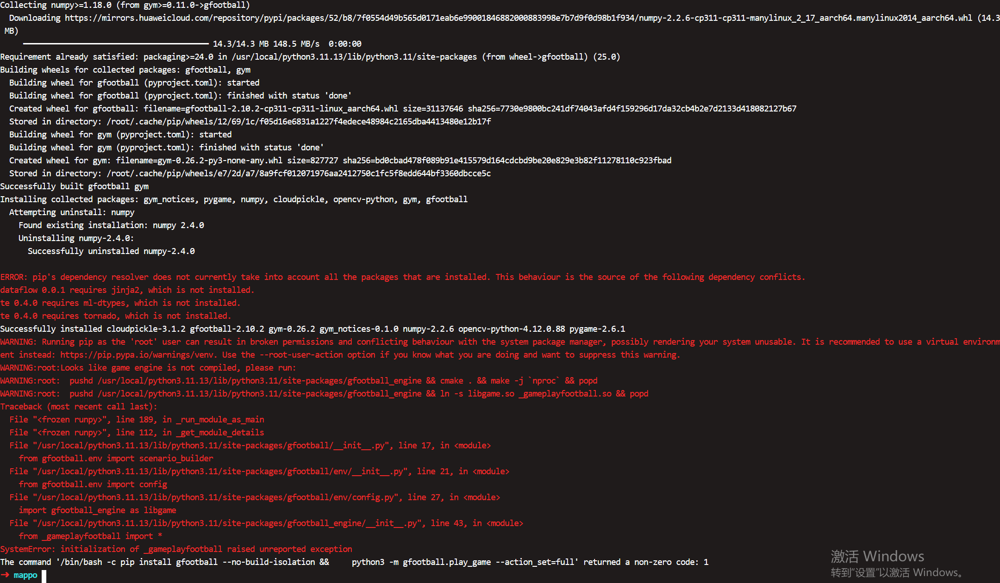

```bash
pushd /usr/local/python3.11.13/lib/python3.11/site-packages/gfootball_engine && cmake . && make -j `nproc` && popd
pushd /usr/local/python3.11.13/lib/python3.11/site-packages/gfootball_engine && ln -s libgame.so _gameplayfootball.so && popd
```

